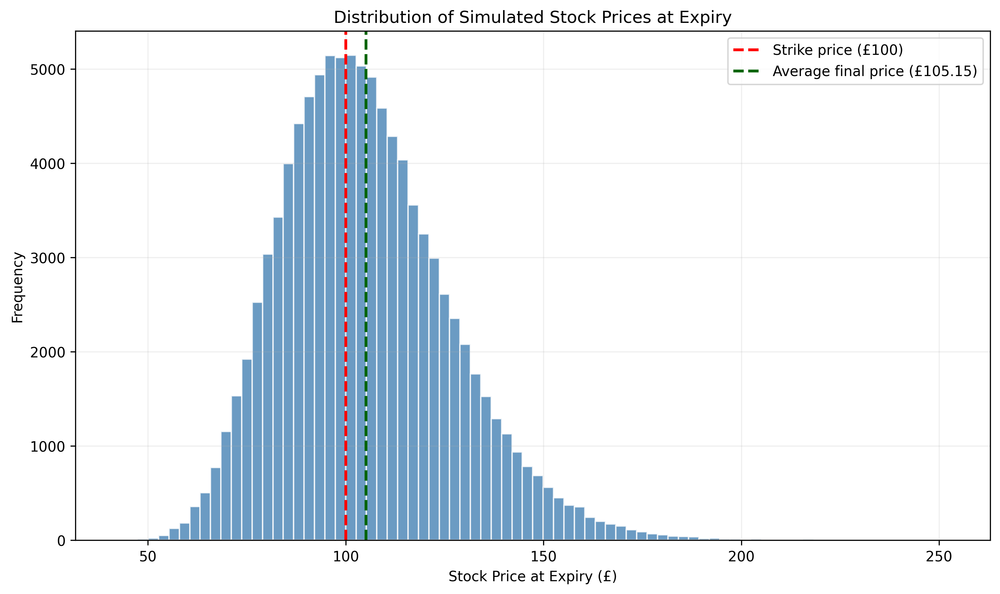
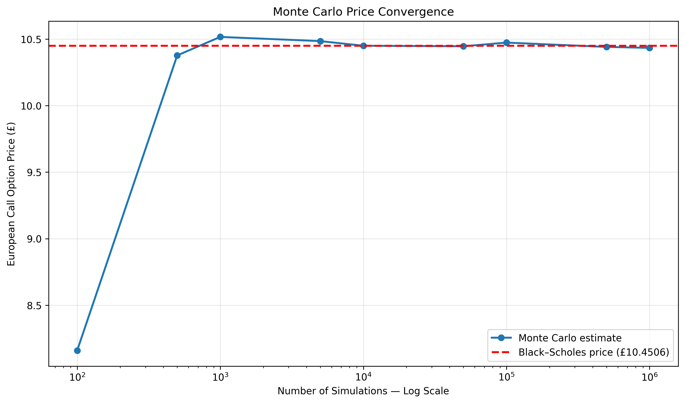

# Monte Carlo Option Pricing Engine

A Python-based Monte Carlo simulation for pricing a European call option under geometric Brownian motion. The simulated price is benchmarked against the analytical Black–Scholes value, with convergence, sampling uncertainty and computational cost also investigated.

## Project Overview

This project simulates possible stock prices at expiry under the risk-neutral measure. The resulting European call-option payoffs are averaged and discounted to estimate the option's present value.

The project also:

- Benchmarks the Monte Carlo estimate against Black–Scholes
- Calculates the absolute and percentage pricing error
- Constructs a 95% confidence interval
- Tests convergence across different simulation sizes
- Measures the relationship between accuracy and computation time
- Visualises the distribution of simulated terminal stock prices
- Evaluates the model's assumptions and limitations

## Methodology

Terminal stock prices are simulated using geometric Brownian motion:

\[
S_T = S_0 \exp\left[\left(r-\frac{1}{2}\sigma^2\right)T
+ \sigma\sqrt{T}Z\right]
\]

The European call payoff is:

\[
\max(S_T-K,0)
\]

The Monte Carlo option value is calculated by discounting the average simulated payoff:

\[
C_0 = e^{-rT}\mathbb{E}[\max(S_T-K,0)]
\]

## Initial Parameters

| Parameter | Value |
|---|---:|
| Current stock price | £100 |
| Strike price | £100 |
| Time to expiry | 1 year |
| Risk-free rate | 5% |
| Annual volatility | 20% |
| Simulations | 100,000 |

These are illustrative assumptions rather than live market inputs.

## Results

Using 100,000 simulations:

- **Monte Carlo price:** £10.4739
- **Black–Scholes price:** £10.4506
- **Absolute error:** £0.0233
- **Percentage error:** 0.223%

The Black–Scholes price fell within the Monte Carlo model's 95% confidence interval, suggesting that the difference was consistent with normal sampling uncertainty.

## Visualisations

### Distribution of simulated prices

### Monte Carlo convergence

The convergence experiment shows that estimates fluctuate considerably at low simulation counts. As the sample size increases, the estimate becomes more stable around the Black–Scholes benchmark, although convergence is not perfectly smooth because of random sampling error.

## Technologies Used

- Python
- NumPy
- pandas
- Matplotlib
- SciPy
- Google Colab

## Model Limitations

The model assumes:

- Constant volatility and interest rates
- Risk-neutral geometric Brownian motion
- Lognormally distributed stock prices
- No sudden price jumps
- Continuous trading
- Perfect liquidity
- No transaction costs or taxes
- European exercise

Real markets exhibit changing volatility, extreme returns, liquidity constraints and volatility smiles. The model should therefore be viewed as a theoretical benchmark rather than a complete representation of financial markets.

## Possible Extensions

- European put-option pricing
- Put-call parity validation
- Option Greeks
- Antithetic variates and other variance-reduction methods
- Path-dependent options
- Implied volatility analysis
- Live market-data inputs

## How to Run

1. Download or clone the repository.
2. Open `Monte_Carlo_Option_Pricing.ipynb` in Google Colab or Jupyter Notebook.
3. Run all cells in order.

## Author
Arjun Patil
